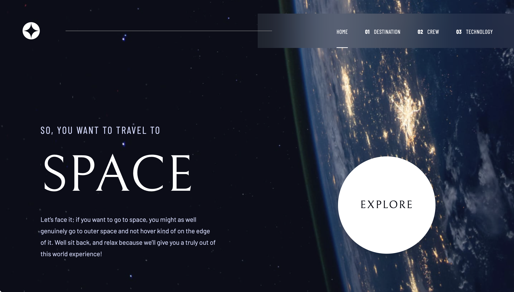

# Frontend Mentor - Space tourism website solution

This is a solution to the [Space tourism website challenge on Frontend Mentor](https://www.frontendmentor.io/challenges/space-tourism-multipage-website-gRWj1URZ3). Frontend Mentor challenges help you improve your coding skills by building realistic projects.

## Table of contents

- [Overview](#overview)
  - [The challenge](#the-challenge)
  - [Screenshot](#screenshot)
  - [Links](#links)
- [My process](#my-process)
  - [Built with](#built-with)
  - [What I learned](#what-i-learned)
  - [Continued development](#continued-development)
  - [Useful resources](#useful-resources)
- [Author](#author)
- [Acknowledgments](#acknowledgments)

**Note: Delete this note and update the table of contents based on what sections you keep.**

## Overview

### The challenge

Users should be able to:

- View the optimal layout for each of the website's pages depending on their device's screen size
- See hover states for all interactive elements on the page
- View each page and be able to toggle between the tabs to see new information

### Screenshot




### Links

- Solution URL: [Github](https://github.com/loifloro/space-tourism)
- Live Site URL: [Github Pages](https://loifloro.github.io/space-tourism)

## My process

### Built with

- Semantic HTML5 markup
- Flexbox
- CSS Grid
- Mobile-first workflow
- [React](https://reactjs.org/) - JS library
- [React Router](https://reactrouter.com/) - React Routing Framework
- [Tailwind CSS](https://tailwindcss.com/) - CSS Utility Library
- [Axios](https://axios-http.com/) - Promise-based HTTP library


### What I learned


#### Using Github Actions to deploy the project to Github Pages. The structure of a Github Actions.

```yml
name: Deploy to Github Pages

on:
  push:
    branches:
      - main

permissions:
  contents: read
  pages: write
  id-token: write

jobs:
  build:
    runs-on: ubuntu-latest
    steps:
      - name: Checkout code
        uses: actions/checkout@v4

      - name: Install and Build
        run: |
          npm ci
          npm run build

      - name: Upload GitHub Pages Artifact
        uses: actions/upload-pages-artifact@v3
        with:
          path: ./build/client/


  deploy:
    runs-on: ubuntu-latest
    needs: build
    steps:
      - name: Deploy to GitHub Pages
        uses: actions/deploy-pages@v4
```

Workflow
- a file located in .github/workflow/<name>.yml
- this fule runs the jobs

Events
- action that will trigger the job/task to run

Jobs
- set of steps performing the task executed on the same runner

Actions
- specific application that will be used performing the jobs
- uses: <the-application>

Runner
- the virtual server that will run the job

Permissions
- set of permissions that the workflow can do such as read or write


#### Using React useEffect on fetching asynchronous request with Axios
```js
useEffect(() => {
    const fetchData = async () => {
        try {
            setIsLoading(true);

            const destinations = (await axios.get<Data>("data.json")).data[
                "destinations"
            ];

            setDestinations(destinations);

            setCurrentDestination(
                destinations.find(
                    (dest) => dest.name === selectedDestination
                )
            );

            setIsLoading(false);
        } catch (error: any) {
            // @todo add error handling

            console.error(error.message);
        }
    };

    fetchData();
}, []);
```

#### Deploying React Router Vite without Server Side Rendering

When deploying React Router as a Framework to Github Pages, I disabled the `ssr` config on the `react-router.config.ts`.

I also defined the basename on `vite.config.ts` so that the Github Pages knows the entry point of the project.

```js
export default defineConfig({
  base: "/space-tourism/",
  plugins: [tailwindcss(), reactRouter(), tsconfigPaths()],
});
```

### Continued development

On continues development, I will incorporate loaders when the Axios is still fetching from the data.json file. I will also use the Three.js or Framer motion to add animations on the project.

### Useful resources

- [Creating a useClickOutside hook](https://www.robinwieruch.de/react-hook-detect-click-outside-component/) - This blog helped me to create a custom hook to handle the mobile menu to close when clicking outside.

## Author

- Website - [Lois Floro](https://loix.vercel.app/)
- Frontend Mentor - [@loifloro](https://www.frontendmentor.io/profile/loifloro)
- Twitter - [@lois_today](https://x.com/lois_today)

## Acknowledgments

I would like to thank [Robin Wieruch](https://www.robinwieruch.de/) for his informative blog for creating his blog about Detecting Click outside of Component.

